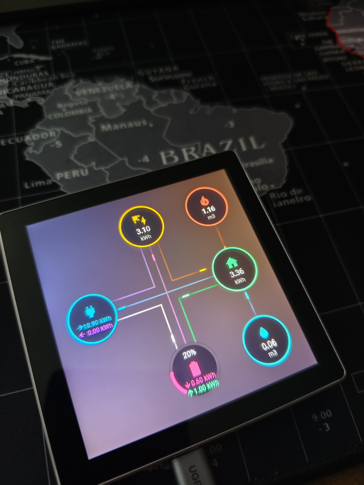

# ESPHome Energy Dashboard

A modular ESPHome project that visualizes daily energy distribution similar to Home Assistant, with real-time data on solar production, grid consumption/feed-in, battery status, and gas consumption, on the [Guition-ESP32-S3-4848S040](https://devices.esphome.io/devices/guition-esp32-s3-4848s040/) display.

The first page shows daily accumulated energy consumption similar to Home Assistant's energy distribution.



Tap the screen to transition to a second page showing the current load.


## Prerequisites

- **Hardware**: Guition-ESP32-S3-4848S040 (ESP32-S3 with 4.8" IPS touch display)
- **Software**:
  - ESPHome (local or container)
  - Home Assistant with ESPHome Integration (for sensor data)

## Installation and Setup

### 1. Clone the Repository

```bash
git clone https://github.com/your-username/esphome-energy-dashboard.git
cd esphome-energy-dashboard
```

### 2. Configure Secrets

Create or edit the `secrets.yaml` file and add your own values:

```yaml
wifi_ssid: "Your_WiFi_Name"
wifi_password: "Your_WiFi_Password"
api_key: "Your_ESPHOME_API_Key"  # Generate a secure key
```

**Important**: Use a strong API key (e.g., 32 characters long). You can generate one with `openssl rand -base64 32`.

### 3. Customize the Project and Adjust Entities

Customize the project to your requirements.
Ensure that the entity IDs in `sensors/homeassistant.yml` match your HA sensors. Example entities:

- `sensor.deye_inverter_deye_daily_production` (Solar production)
- `sensor.electricity_daily_consumption` (Home consumption)
- `sensor.deye_inverter_deye_battery_soc` (Battery SOC)

The dashboard should work regardless of whether the sensors exist or not.

Note: The dashboard requires sensors that accumulate daily consumption values, similar to Home Assistant's energy distribution feature. While Home Assistant typically uses total meters, here daily meters are needed. Since the daily accumulated values from the energy dashboard are not accessible, I created utility meters in Home Assistant for daily consumption.

### 4. Start Docker-Compose

Start the ESPHome container in the background:

```bash
docker-compose up -d
```

The container mounts the config directory and runs in host network mode for easy access.

### 5. Compile and Flash Firmware

Connect your ESP32 via USB and flash the firmware:

```bash
docker-compose exec esphome 

esphome run main.yml --device=/dev/ttyUSB0
```

**Notes**:
- Adjust the device path (`/dev/ttyUSB0`) to your system (e.g., `/dev/ttyACM0` on some Linux systems).
- Ensure your user has access to the USB port (use `sudo` if necessary or adjust udev rules).
- The first flash will compile the firmware – this may take several minutes.

Adjust the entity IDs as needed.

## Usage

After successful startup, the display shows a loading screen followed by the main dashboard. Touch the screen to switch between dashboard and detailed power table.

- **Dashboard**: Overview with energy flow diagrams and current values.
- **Power Table**: Detailed table showing the current load.

The backlight turns off during OTA updates and can be controlled via Home Assistant.

## Customize Configuration

The configuration is modular:

- `base/hardware.yml`: Hardware-specific settings (display, I2C, SPI)
- `base/network.yml`: WiFi, API, OTA
- `sensors/homeassistant.yml`: HA sensors
- `ui/*.yml`: UI components (fonts, layout, animations)

## Contributions

Contributions are welcome! Create issues for bugs or feature requests, or submit pull requests.

## License

This project is licensed under the MIT License. See [LICENSE](LICENSE) for details.